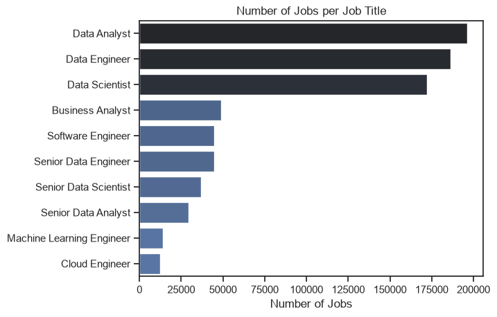
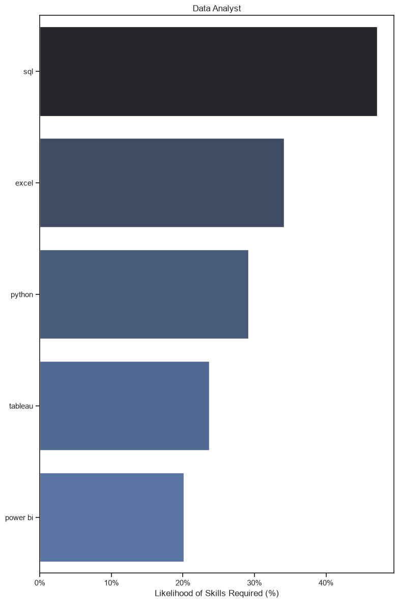
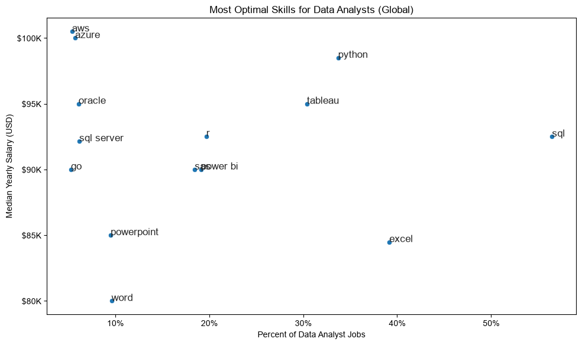

# 📊 Python Job Market Trends & Data Analysis

An analytical project exploring the global job market for data roles using **Python** and data analysis libraries to uncover top jobs, in-demand skills, monthly trends, and salary insights.

---

## 🚀 Project Overview
This project relies on real-world data job postings, structured into modular Jupyter Notebooks covering exploratory data analysis, cleaning, visualization, and optimal skill identification.

---

## 📈 Key Findings & Visualizations

### 1. Most Popular Job Titles
An overview of the most in-demand job titles in the market:

---

### 2. In-Demand Skills for Data Analysts
The proportion of company demand for various skills among data analysts:

---

### 3. Monthly Skills Trend
How the demand for top skills changes across the months of the year:

---

### 4. Most Optimal Skills (Salary vs Demand)
The most critical chart in the project; showing the relationship between skill demand percentage and annual median salaries to identify the most valuable skills to learn:

---

## 🛠️ Tech Stack & Libraries
* **Python** 🐍
* **Pandas & NumPy** (For data manipulation and cleaning)
* **Seaborn & Matplotlib** (For data visualization)
* **Datasets** (For fetching job market data)

---